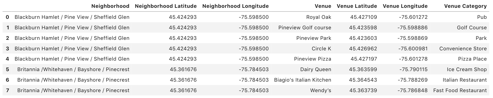

## Data Description
### Data Description
As we need to analyze the restaurant distribution and explore various venues, the neighborhoods in the city of Ottawa need to be collected. First, we scrap the neighborhoods through Wikipedia page. Before we proceed to the next step, we need to clean up the obtained data. Then, we need acquire the corresponding coordinates of each neighborhood. The coordinates information will help us obtain more useful information for this project. After these steps, the data are organized in a format like the following: 

### Data Feature
To explore more information of Ottawa, we use Foursquare api to explore the venues in each neighborhood of Ottawa. For each neighborhood, we collect the venue name and the venue category. The samples of collected data is shown below:

### Data usage
The collected data will be used in the following way: 
1. I will explore the distribution of the restaurant and analyze the influence of the existing restaurants. 
2. Then, we show the influence area of each restaurant. According to this information, we can choose the locations which are not covered by the current restaurant as candidates.
3. I will cluster these restaurants and analyze the restaurant category of each cluster. Then, according to the ranked restaurant category, the best restaurant type in each cluster can be selected.