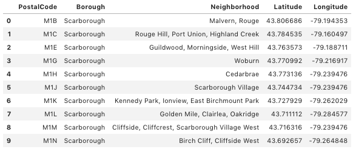
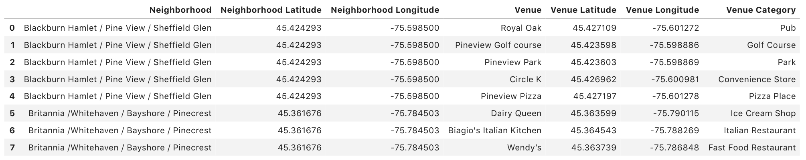

# Ottawa Restaurant report
Xiren Ma
mathewxiren@gmail.com
## Introduction
### Problem Background
Ottawa is the capital of Canada, which is also a place full of diverse cultures. Recently, Ottawa has attracted many tourists and students with its unique scenery and quiet learning environment. 

However, the number and diversity of existing restaurants cannot satisfy the rapidly growing population. Thus, many investors are preparing to invest in various restaurants to meet the growing demand.

### Problem Description
A large restaurant chain is preparing to open its own store in Ottawa. The company needs to review the current restaurant location, and the category of these restaurants. Then, they can evaluate whether it is worth opening a restaurant in Ottawa. If they decide to open, where is the best location to start their first restaurant.

### Project Goal
The project will analyze the distribution of the restaurants in Ottawa. Then come up with a report to show which neighborhood will be the best choice to start the first restaurant.

### Target Audience
The restaurant company would be very interested in the analysis of restaurant distribution. Investors who are interested in investing a restaurant will also be the target audience.

## Data
### Data Description
As we need to analyze the restaurant distribution and explore various venues, the neighborhoods in the city of Ottawa need to be collected. First, we scrap the neighborhoods through Wikipedia page. Before we proceed to the next step, we need to clean up the obtained data. Then, we need acquire the corresponding coordinates of each neighborhood. The coordinates information will help us obtain more useful information for this project. After these steps, the data are organized in a format shown in Fig. 1. 
| |
|:--:| 
| *Fig. 1. Sample of Ottawa neighborhoods.* |

### Data Feature
To explore more information of Ottawa, using Foursquare api to explore the venues in each neighborhood of Ottawa. For each neighborhood, collecting the venue name and the venue category. The samples of collected data is shown in Fig. 2.
| |
|:--:| 
| *Fig. 2. Sample of Ottawa venues.* |
