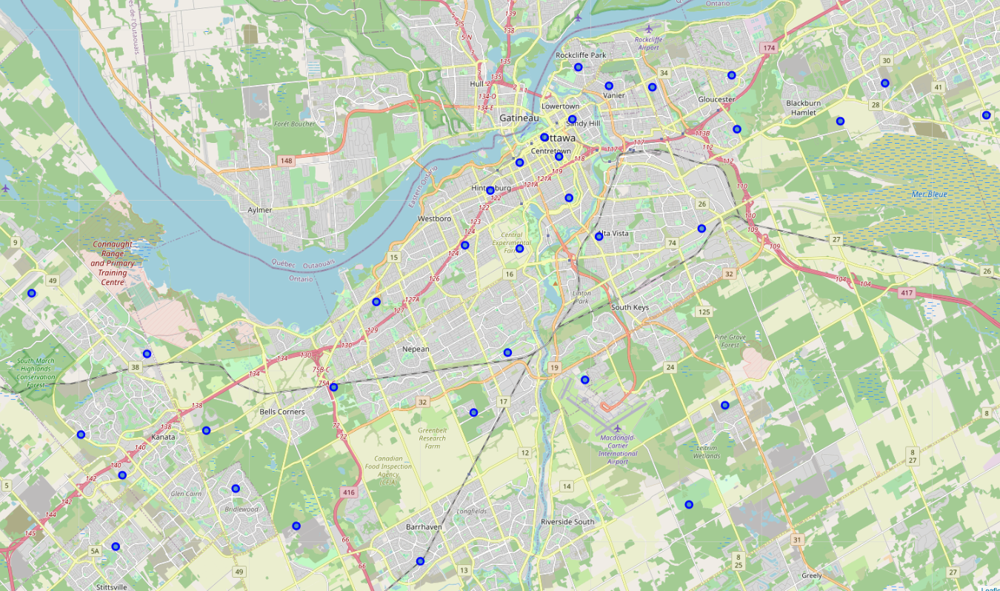
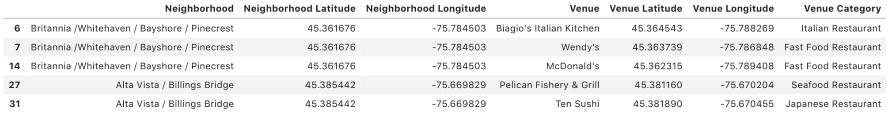
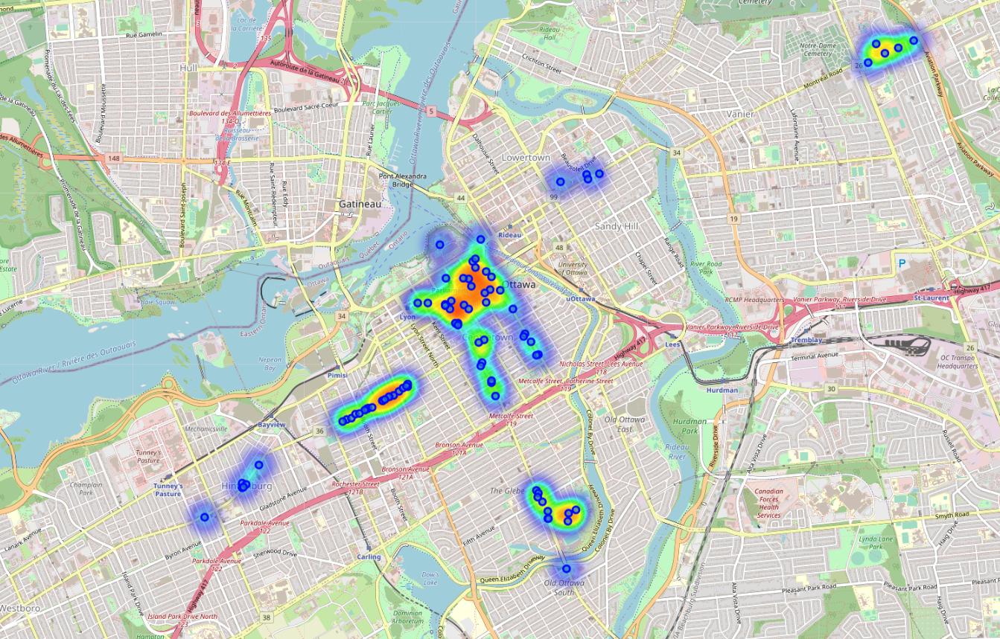
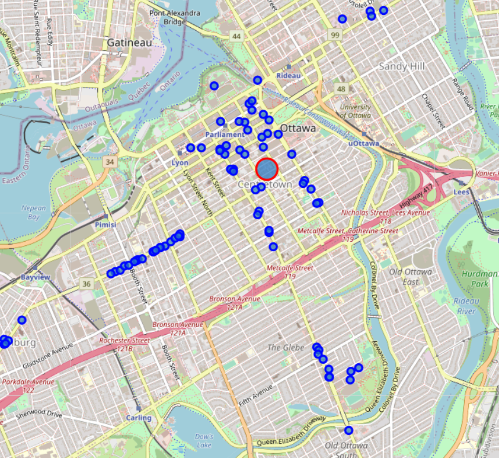
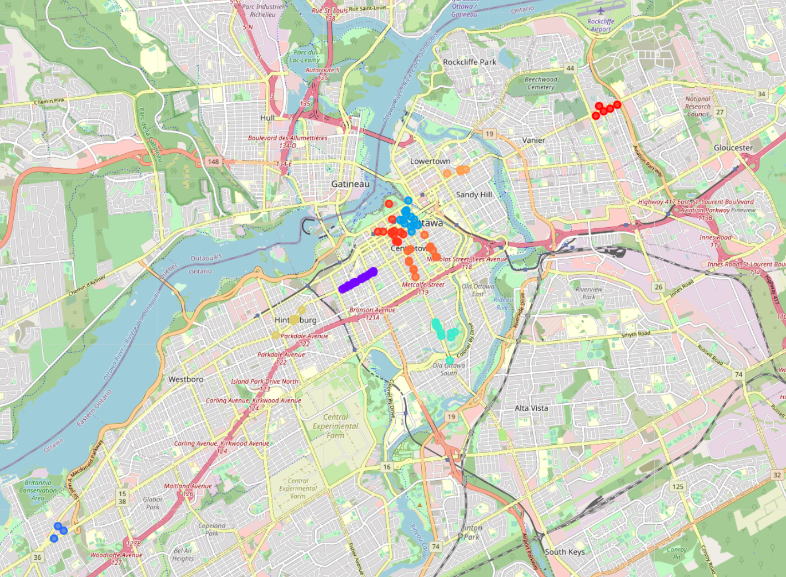
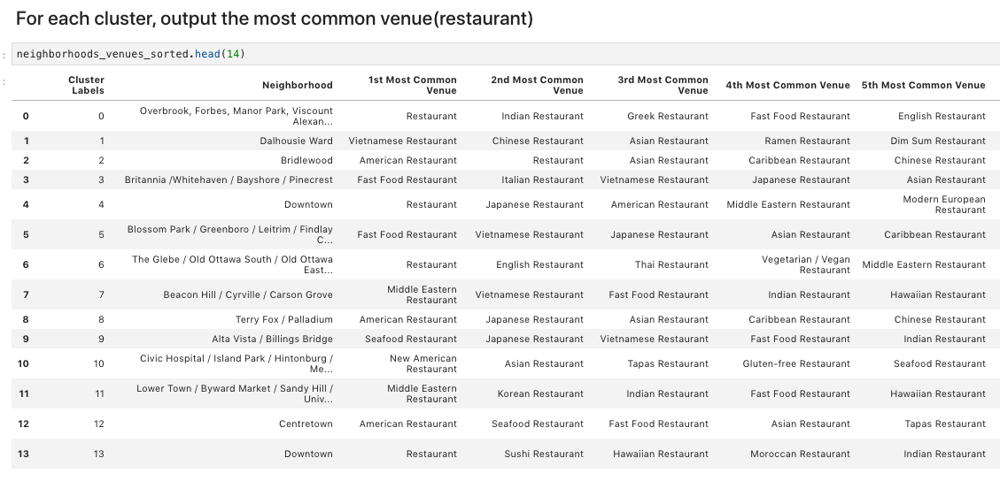
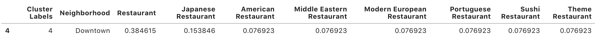
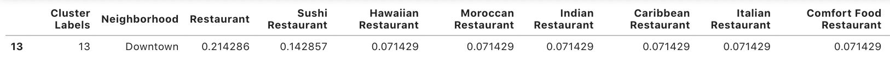

# Ottawa Restaurant report
Xiren Ma
mathewxiren@gmail.com
## Introduction
### Problem Background
Ottawa is the capital of Canada, which is also a place full of diverse cultures. Recently, Ottawa has attracted many tourists and students with its unique scenery and quiet learning environment. 

However, the number and diversity of existing restaurants cannot satisfy the rapidly growing population. Thus, many investors are preparing to invest in various restaurants to meet the growing demand.

### Problem Description
A large restaurant chain is preparing to open its own store in Ottawa. The company needs to review the current restaurant location, and the category of these restaurants. Then, they can evaluate whether it is worth opening a restaurant in Ottawa. If they decide to open, where is the best location to start their first restaurant.

### Project Goal
The project will analyze the distribution of the restaurants in Ottawa. Then come up with a report to show which neighborhood will be the best choice to start the first restaurant.

### Target Audience
The restaurant company would be very interested in the analysis of restaurant distribution. Investors who are interested in investing a restaurant will also be the target audience.

## Data
### Data Description
As we need to analyze the restaurant distribution and explore various venues, the neighborhoods in the city of Ottawa need to be collected. First, we scrap the neighborhoods through Wikipedia page. Before we proceed to the next step, we need to clean up the obtained data. Then, we need acquire the corresponding coordinates of each neighborhood. The coordinates information will help us obtain more useful information for this project. After these steps, the data are organized in a format shown in Fig. 1. 
| |
|:--:| 
| *Fig. 1. Sample of Ottawa neighborhoods.* |

### Data Feature
To explore more information of Ottawa, using Foursquare api to explore the venues in each neighborhood of Ottawa. For each neighborhood, collecting the venue name and the venue category. The samples of collected data is shown in Fig. 2.
| |
|:--:| 
| *Fig. 2. Sample of Ottawa venues.* |

### Data usage
The collected data will be used in the following way: 
* Explore the distribution of the restaurant and analyze the influence of the existing restaurants. 
* Show the influence area of each restaurant. According to this information, we can choose the locations which are not covered by the current restaurant as candidates.
* Cluster these restaurants and analyze the restaurant category of each cluster. Then, according to the ranked restaurant category, the best restaurant type in each cluster can be selected.

## Methodology and Result
| |
|:--:| 
| *Fig. 3. The neighborhoods of Ottawa.* |
The neighborhood information of Ottawa is scrapped from the Wikipedia page, which contains the up-to-date neighborhood information. After, acquiring the data, I clean the data and remove the neighborhood that far away from Ottawa. In order to do further analysis, the coordinates of each neighborhood are obtained by using the Geocoder API. By using Folium, we can visualize the center locations of each neighborhood. The neighborhoods of Ottawa is shown in Fig. 3.

### Candidate Restaurant Location 
Futhermore, we need explore the venues in each neighborhood. By using the Foursquare API, the venue information are obtained. Then, for each neighborhood, I only keep the restaurant venues. The samples are shown in Fig. 4. 
| |
|:--:| 
| *Fig. 4. Sample of Ottawa restaurant.* |

Then, to explore the influence area of each restaurant, we can use the HeatMap, which is a plugin of Folium. The restaurants of Ottawa is shown in one map. The visualization of Ottawa restaurant density is shown in Fig. 5. 
| |
|:--:| 
| *Fig. 5. Ottawa restaurant density visualization.* |

 The density shown in the map can be seen as the influence of each restaurant. Then, the uncovered are can be selected as the candidate location. For example, the location shown in Fig. 6(latitude: 45.417623299999994, longitude: -75.694121) can be selected as a good location to open a restaurant.
| |
|:--:| 
| *Fig. 6. Candidate restaurant location (Red circle area).* |

### Candidate Restaurant Category 
To further analyze the restaurant distribution. K-means is used to cluster these restaurant. In the project, the number of kernels is 14. The cluster result in shown in Fig. 7. 
| |
|:--:| 
| *Fig. 7. The clusters of Ottawa restaurant.* |

For each cluster, we can rank the restaurant category according to the number of restaurants of each category. The result is shown in Fig 8.

| |
|:--:| 
| *Fig. 8. The most common restaurant in each cluster.* |

## Discussion
For each cluster, we can estimate which restaurant category would be popular in that area. To strategies are used. First, we can open the same type of restaurant as the most popular restaurant in that area (cluster). A scale effect would occur, once more and more restaurants of the same type are opened. People will come to this place exclusively to eat specific type of food. For instance, in Ottawa downtown, one can open a Japanese restaurant. (according to cluster 4).

| |
|:--:| 
| *Fig. 9. The most common restaurant in cluster 4.* |

Second, we can open a certain type of restaurant which does not exist in that area. People live area can be attracted to the new opened restaurant, if they haven't tried this type of food before, or they tried of eating the same time food. Following this rule, in Ottawa downtown, one can open a Chinese restaurant. (according to cluster 4, 13).

| |
|:--:| 
| *Fig. 10. The most common restaurant in cluster 13.* |

## Conclusion
In this project, I collected and analyzed the restaurant distribution in Ottawa. According to the restaurant density, we can found the candidate locations to open a restaurant. Then, by using k-means, 14 clusters are generated. For each cluster, I ranked the common restaurants in each cluster. By analyzing the restaurant category in each cluster, a suitable restaurant type in an area can be estimated. The following shows the recommendation for opening a restaurant in Ottawa:

* According to the heatmap, a candidate area for opening a restaurant is chose. The location is in downtown of Ottawa, coordinates are (latitude: 45.417623299999994, longitude: -75.694121).
* According to the restaurant categories in each cluster, I use two strategies to choose the restaurant type:
    - Follow the most common restaurant. For instance, in Ottawa downtown, one can open a Japanese restaurant. (according to cluster 4)
    - Open a restaurant type that does not exist in that area. For example, in Ottawa downtown, open a Chinese restaurant. (according to cluster 4, 13)
